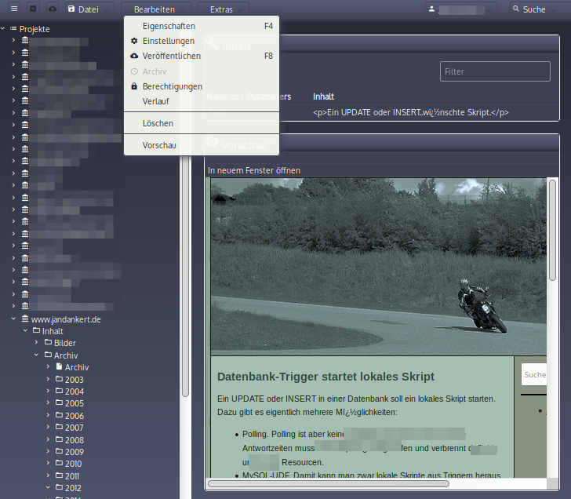

# OpenRat Content Management System

## About

OpenRat is a statifying CMS.

OpenRat generates static files, which are served by a dedicated live web server like Apache, Nginx, Boa etc.

Unlike popular static site generators like Jekyll, JBake etc. OpenRat CMS contains a complete Web UI with user management.

### Why OpenRat?

Yes, there are a lot of good CMS in the world, and a lot of them are available for free. Why should you use OpenRat CMS?

**OpenRat combines the world of static site generators with a complete web UI**. Editors do not have to use a version control system, they only use their browser.

## Install

### What do I need?

You need a server with PHP >= 5.5 and a relational database.

MariaDB and MySQL are recommended, while PostgresQL and SQLite are supported too.
 

#### Download and untar it

Download the complete archive and install it on your server

#### The GIT way

`git pull`

#### Docker

OpenRat contains a Dockerfile. At the moment, you have to bake your own Docker Image.

## Configuration

Edit the file config/config.yml and enter your database access data, like:
 
    database:
      db:
        enabled : true
        dsn     : "mysql:host=localhost; dbname=name_of_db; charset=utf8"
        user    : "user"
        password: "password"

That's it.