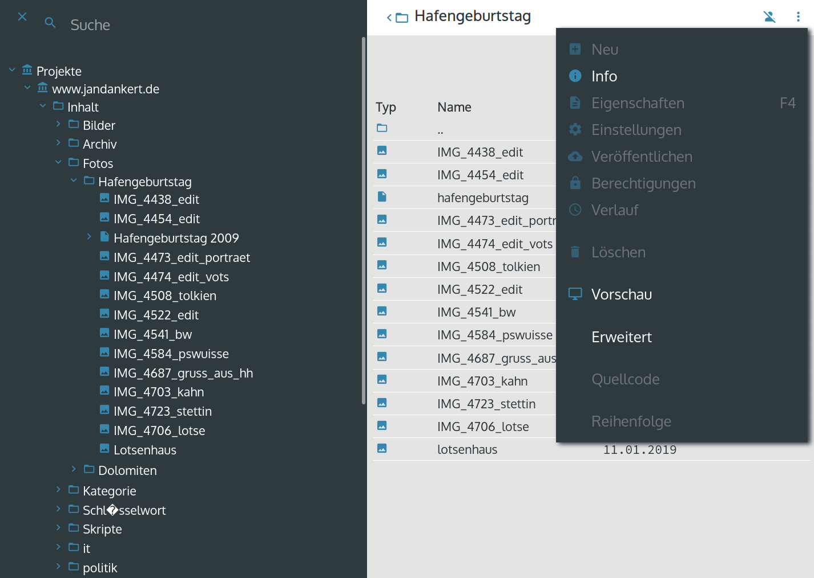

# OpenRat Content Management System




## About

OpenRat is a statifying CMS, also known as a [static site generator](https://en.wikipedia.org/wiki/Web_template_system#Static_site_generators).

OpenRat generates static files, which are served by a dedicated live web server like Apache, Nginx, Boa etc.

Unlike other static site generators OpenRat CMS contains a complete Web UI with user management.

### Why OpenRat?

Yes, there are a lot of good CMS in the world, and a lot of them are available for free. Why should you use OpenRat CMS?

**OpenRat combines the world of static site generators with a complete web UI**. Editors do not have to use a version control system, they only use their browser.


## Install

### Requirements

You need a server with PHP >= 5.6 and a relational database.

MariaDB and MySQL are recommended, while PostgresQL and SQLite are supported too.
 

### Docker

#### Docker-Compose

The easiest way is to start the content-management-system inside a docker machine with an MySql database.
Copy the following lines to a file named `docker-compose.yml`.

```
version: '3.3'

services:
  db:
    image: mysql:5.7
    volumes:
      - db_data:/var/lib/mysql
    restart: always
    environment:
      MYSQL_ROOT_PASSWORD: uoia97723sdsd9782
      MYSQL_DATABASE: cms
      MYSQL_USER: cms
      MYSQL_PASSWORD: dsfg77er35fsd08435
  cms:
    depends_on:
    - db
    image: openrat/openrat-cms:latest
    ports:
    - "8000:8080" # CMS
    - "8001:8081" # public
    - "8002:8082" # public with host routing
    restart: always
    environment:
      DB_TYPE: mysql
      DB_HOST: db
      DB_USER: cms
      DB_PASS: dsfg77er35fsd08435
      DB_NAME: cms
      CMS_MOTD:
      CMS_NAME: Content-Management
      CMS_OPERATOR: Your Company
  volumes:
    db_data: {}
```

Start the environment with `docker-compose up -d`.

Now the CMS is available on [localhost:8000](http://localhost:8000).
The published website is available on [localhost:8001](http://localhost:8001)

#### Start the single CMS docker container

Download and run the docker image from [Dockerhub](https://hub.docker.com/r/openrat/openrat-cms), you need an already  running database.

`docker run -d -p 8080:8080 -e DB_HOST=$host -e DB_NAME=$name -e DB_USER=$user -e DB_PASS=$pass openrat/openrat-cms`

Be sure to replace the variables.

#### Environment variables for Docker

The following environment variables could be set in the docker container: 

| Name      | Description |   Default |
| ----------- | ----------- | ------- |
|DB_TYPE|database type|mysql
|DB_HOST|database hostname|localhost
|DB_NAME|database schema|cms
|DB_USER|database user|
|DB_PASS|database password|
|CMS_MOTD|Message of the day|Welcome to dockerized CMS
|CMS_NAME|Software name|OpenRat CMS (Docker)
|CMS_OPERATOR|Name of your company|Docker-Host


### Local installation

The old style local installation is possible with the following steps.

#### Download and untar it

Download the [latest release](https://github.com/dankert/openrat-cms/releases) from Github and install it on your server.

#### Clone GIT repository

Or clone the GIT repository with the command

`git clone http://git.code.weiherhei.de/openrat-cms.git`

or from Github

`git clone https://github.com/dankert/openrat-cms.git`

#### Add database configuration

Edit the file `config/config.yml` and enter your database access data, like:

    database:
      db:
        enabled : true
        dsn     : "mysql:host=localhost; dbname=name_of_db; charset=utf8"
        user    : "user"
        password: "password"

